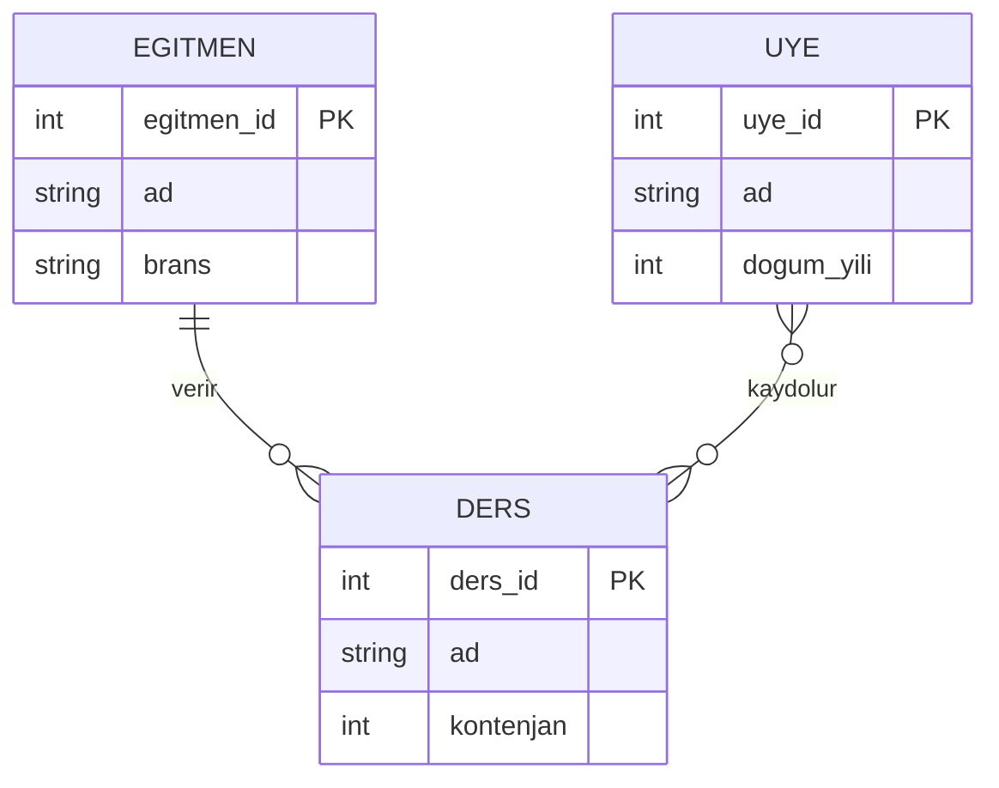

# Yapay Zeka Köşesi — AI Eleştiri Raporu

## Kullanılan Araç ve İstem

**Araç:** ChatGPT (GPT-4o)

**İstemim:**
> "Merkezde eğitmenler çalışır; her eğitmenin bir adı ve branşı vardır. Eğitmenler ders verir: her dersin bir adı, kontenjanı ve dersi veren tek bir eğitmeni vardır; bir eğitmen ise birden çok ders verebilir. Merkezin üyeleri (ad, doğum yılı) bu derslere kaydolur: bir üye birden çok derse yazılabilir, bir derste birden çok üye olabilir; her kaydın bir tarihi tutulur. Bu senaryoyu Mermaid erDiagram formatında çizer misin?"

---

## Yapay Zekanın Çıktısı



---

## Yapay Zeka Çıktısı Üzerine Eleştirilerim

ChatGPT senaryoyu okuyunca Eğitmen ve Ders arasındaki `1:N` ilişkiyi hemen anlamış, orası doğru. Ama iş Üye ve Ders arasındaki `N:M` (çoktan çoğa) ilişkiye gelince fena çuvalladı. İki tane temel hatası var:

### 1. N:M İlişkiyi Ara Tablosuz Doğrudan Bağlamış
Yapay zeka, üye ile ders arasındaki N:M ilişkiyi `UYE }o--o{ DERS : "kaydolur"` şeklinde dümdüz birbirine bağlamış. Derste de gördüğümüz gibi ilişkisel veritabanlarında böyle doğrudan çoktan çoğa bir bağlantı kuramayız. İki tarafın da birincil anahtarlarını taşıyan bir ara tabloya (KAYIT gibi) ihtiyacımız var ki işler karışmasın.

### 2. Kayıt Tarihi Tamamen Ortadan Kaybolmuş
Senaryoda açıkça "her kaydın bir tarihi tutulur" dememe rağmen, yapay zeka ara tablo oluşturmadığı için `tarih` bilgisini koyacak yer bulamamış ve resmen yutmuş. Hiçbir tabloda tarih diye bir alan yok. Eğer bu tasarımı kullanırsak kimin hangi derse ne zaman kayıt olduğunu asla bilemeyiz. Kayıt tarihi gibi ilişkiye ait özellikler mutlaka ara tabloda tutulmalıdır.

**Benim çözümüm ve Mermaid düzeltmesi:**
Bu hataları düzeltmek için araya bir `KAYIT` tablosu açtım ve `tarih` özelliğini buraya ekledim. N:M ilişkiyi de iki tane 1:N ilişkiye dönüştürerek çözdüm. Olması gereken doğru yapı şu şekilde:

```mermaid
UYE ||--o{ KAYIT : "kaydolur"
DERS ||--o{ KAYIT : "icerir"

KAYIT {
    int kayit_id PK
    int uye_id FK
    int ders_id FK
    date tarih
}
```
